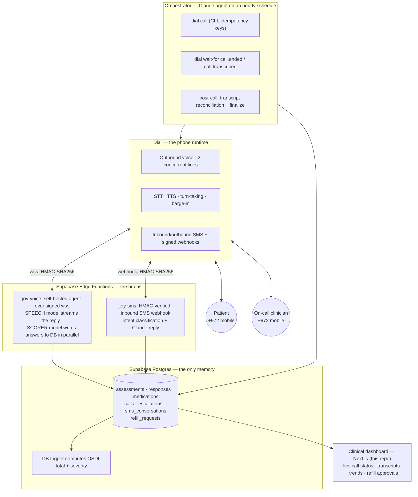

<div align="center">


# Joy — the AI clinician's assistant that lives on a phone number

**📞 My Agent Has a Phone · Dial (getdial.ai) · Tel Aviv, June 11–12 2026**


🖥️ **Live clinician dashboard:** [v0-clinical-decision-support-alpha.vercel.app/dashboard](https://v0-clinical-decision-support-alpha.vercel.app/dashboard)

</div>

---

## The 30-second pitch

Chronic-disease follow-up is a phone problem. Dry-eye patients are supposed to be re-assessed between visits with the OSDI questionnaire (12 questions, validated, scored 0–100) — in practice nobody does it, and the clinics that do burn precious clinician hours a doctor could spend in surgery. Staff phone-rounds don't scale and patients ignore web portals. The patients who dominate chronic eye disease are exactly the ones a web app can't reach.

**Joy is an autonomous agent that calls the patient**, runs the OSDI as a natural conversation, **scores every answer into the clinical database in real time while still on the line**, and — if the patient mentions a red-flag symptom mid-sentence — **picks up a second phone line and calls the clinic within seconds**, while the patient call is still going. Between visits, Joy also watches the medication table and runs an **SMS refill loop**: it texts patients who are running low, holds the conversation, and files the refill request for the doctor to approve.

No app, no install, no portal login. The patient's entire UX is: **their phone rings.**

## What's in the box

| Loop | Channel | What happens |
|---|---|---|
| **Clinical assessments** | Outbound voice | Joy calls the patient, conducts the OSDI conversationally; a second model instance silently scores each answer into Postgres *mid-call* |
| **Critical escalation** | Voice → voice | A red-flag symptom ("sudden vision loss") triggers an outbound call to the on-call clinician **on a second concurrent line** — the patient is still talking to Joy on line 1 |
| **Medication refills** | Outbound + inbound SMS | Joy detects meds running out within 7 days, texts the patient, handles the reply (yes / no / escalate), and creates a `refill_request` |
| **Clinician dashboard** | Web (this repo) | Next.js app where everything lands: live Joy call status, assessment history with full call transcripts, score-trend charts, refill-request approvals, analytics, English/Hebrew |

## Live numbers (production DB, at submission)

| Metric | Value |
|---|---|
| Patient follow-up calls placed by Joy | 9 |
| Answers scored into the DB **mid-call** | 123 |
| Assessments finalized (score + severity computed) | 17 |
| Critical escalations detected | 5 |
| Escalation calls placed to the clinic | 4 (incl. one automatic retry after a rejected call) |
| Medication-change records captured by voice | 5 |

Every one of these came from real calls and texts to a real Israeli mobile number — simulated patient, **real telephony end-to-end**.

## Architecture



Three runtimes, one source of truth: the **orchestrator** owns the workflow (place call → wait for events → reconcile transcript → finalize), the **edge functions** own each conversation turn, and **Postgres is the entire memory** — any component can crash and the next run resumes from state. Full deep-dive with sequence diagrams: **[`agent-backend.md`](agent-backend.md)**.

## Dial is the spine, not a bolt-on

| Dial primitive | Where it carries the system |
|---|---|
| **Self-hosted agent protocol** (wss) | The deepest integration Dial offers — we replaced Dial's managed agent entirely. Every call opens an HMAC-SHA256-signed WebSocket to `joy-voice`; Dial does telephony/STT/TTS/barge-in, our Claude models do the thinking |
| **Outbound calls via CLI** | Orchestrator places patient and clinic calls with idempotency keys and retry-same-key semantics on ambiguous failures |
| **Two concurrent calls, one number** | The escalation call to the clinic rings while the patient call is still live — phone-to-phone coordination, machine-initiated |
| **Event system** (`dial wait-for`) | `call.ended` / `call.transcribed` events are the orchestrator's main loop ([`lib/dial.ts`](lib/dial.ts) long-polls `/api/v1/events/wait`) |
| **SMS, both directions** | Outbound refill prompts via `/api/v1/messages`; inbound replies hit the signed `joy-sms` webhook ([`supabase/functions/joy-sms`](supabase/functions/joy-sms/index.ts)) |
| **Transcript retrieval** | Post-call, the orchestrator pulls the full transcript and reconciles every mid-call score against it |

**The hard parts were actually handled** — instant canned greeting at pickup (zero model latency), clause-buffered TTS streaming with a backchannel filler past 1.2s, a speech/scorer model split so DB writes never delay speech, idempotent upserts everywhere, auto-retry on rejected escalation calls, and graceful degradation when a transcript never arrives.

**Honest engineering under a real constraint:** we hit an undocumented ~75-second cap on self-hosted calls (we isolated it to Dial's side). Rather than fake around it, the assessment became a **resumable state machine** — each call makes incremental progress and the next call continues from the live DB rows. That's what production telephony actually looks like.

## How this maps to the judging criteria

**1 · Real-world impact & market.** Between-visit symptom tracking is reimbursable (remote patient monitoring), barely happens today, and drives real treatment decisions. Who pays is obvious: clinics and HMOs already fund nurse phone-rounds — Joy turns that cost center into an automated, auditable pipeline. The machine generalizes by swapping the question set: PHQ-9, post-op checklists, adherence checks. And the phone is the *only* channel that reaches this patient population.

**2 · Execution & Dial depth.** Six Dial primitives wired together (table above), with the self-hosted agent protocol — Dial's hardest primitive — at the core. Live under demo conditions, with latency, call state, and failure modes engineered, not hoped away.

**3 · Phone-native innovation.** Three things here cannot exist without a programmable phone layer: an agent that uses the phone **in both directions of care concurrently** (escalation call ringing while the patient call is live); a conversation that **is** the ETL pipeline (two Claude instances ride one call — one speaks, one commits structured clinical data sub-turn); and conversational guarantees **enforced in code, not prompt-hope** (the reply stream is hard-cut at the first question mark, so batching questions is mechanically impossible; the call can't end before the patient says goodbye).

Would this be impressive without the phone? It wouldn't *exist* without the phone.

## Repo tour

```
app/                      Next.js 16 (App Router) clinical dashboard
  dashboard/              Patient list, live Joy indicator, refill-requests panel
  patient/[id]/           Assessment history, score-trend chart, transcripts, notes
  api/joy/sms/            Refill loop: trigger, inbound webhook, conversations
  api/joy/call-status/    Live Joy status for the dashboard indicator
  api/assessment/submit   Structured assessment ingestion (contract: RETELL_API_DOCUMENTATION.md)
lib/
  dial.ts                 Dial REST client: sendSMS + waitForEvent (long-poll)
  joy-sms-agent.ts        Refill agent: low-med detection, conversation state, Claude replies
supabase/functions/
  joy-sms/                Deno edge function — HMAC-verified inbound-SMS webhook
scripts/                  SQL migrations (07 = consolidated restore, idempotent)
agent-backend.md          ★ Deep dive: Joy's voice architecture, sequence diagrams, design decisions
SETUP.md                  Database provisioning + schema overview
```

## Running the dashboard locally

**Prerequisites:** Node.js 20+ and [pnpm](https://pnpm.io). If you don't have pnpm yet, the easiest way is through Corepack (ships with Node):

```bash
corepack enable pnpm     # or: npm install -g pnpm
```

Then clone, configure, and run:

```bash
git clone https://github.com/OfekZad/clinical-dashboard.git
cd clinical-dashboard
pnpm install                 # install dependencies
cp .env.example .env.local   # fill in the vars below (or skip for seed-data mode)
pnpm dev                     # start the dev server → http://localhost:3000
```

For a production build:

```bash
pnpm build && pnpm start
```

| Variable | Purpose |
|---|---|
| `NEXT_PUBLIC_SUPABASE_URL` / `NEXT_PUBLIC_SUPABASE_ANON_KEY` | Dashboard ↔ Supabase. **Without them the app runs on built-in seed data** — you can demo the UI with zero setup |
| `SUPABASE_SERVICE_ROLE_KEY` | Server-side writes (refill agent, conversation state) |
| `DIAL_API_KEY` / `DIAL_PHONE_NUMBER_ID` | Outbound SMS + event long-polling via Dial |
| `ANTHROPIC_API_KEY` | Claude replies in the SMS refill loop |

To provision a fresh database, run `scripts/07-restore-clinical-data.sql` then `scripts/08-add-fk-indexes.sql` — details and the security posture (RLS intentionally off for this single-clinic hackathon build) are in [`SETUP.md`](SETUP.md).

## What we'd ship next

Resolve the 75s self-hosted call cap with the Dial team (the state machine already supports chained calls), inbound — patients call Joy back on the same number (self-hosted mode already routes inbound to the same brain), post-assessment SMS summaries to patients, and multi-clinic tenancy on the same Postgres.

---

<div align="center">

**Built in one night on Dial, Claude, Supabase, and Next.js.**
*The patient's entire UX is: their phone rings.*

</div>
