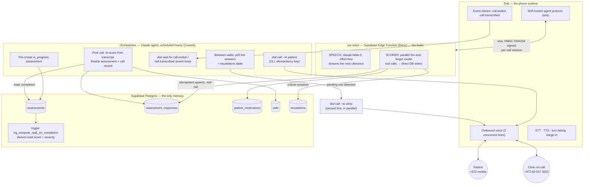
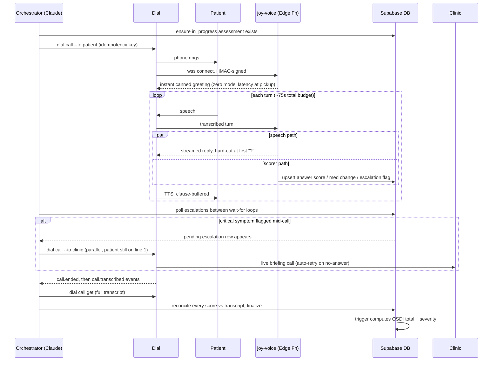
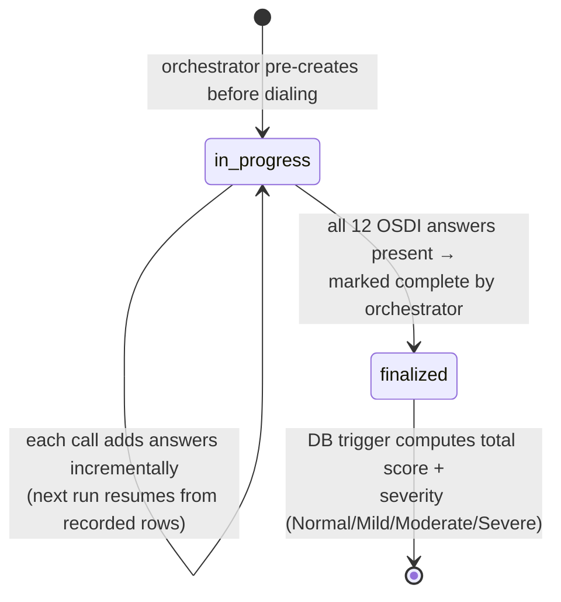

# Joy — An AI Clinician's Assistant That Lives on a Phone Number

**Hackathon: My Agent Has a Phone · Dial (getdial.ai) · Tel Aviv, June 11–12 2026**
**Builder: Ofek (ofekz555@gmail.com) · Joy's number: +1 (912) 662-0889**

---

## The 30-second pitch

Chronic-disease follow-up is a phone problem. Dry-eye patients are supposed to be re-assessed with the OSDI questionnaire (12 questions, validated, score 0–100) between visits — in practice nobody does it, because it takes clinic staff time and patients don't fill in web forms. Joy is an autonomous agent that **calls the patient**, runs the OSDI as a natural conversation, **scores every answer into the clinical DB in real time while still on the line**, and — if the patient mentions a red-flag symptom mid-sentence — **picks up a second phone line and calls the clinic within seconds**, while the patient call is still going.

No app, no install, no portal login. The patient's entire UX is: their phone rings.

## Live numbers (production DB, as of submission)

| Metric | Value |
|---|---|
| Patient follow-up calls placed by Joy | 9 |
| Answers scored into the DB mid-call | 123 |
| Assessments finalized (score + severity computed) | 17 |
| Critical escalations detected | 5 |
| Escalation calls placed to the clinic | 4 (incl. one automatic retry after a rejected call) |
| Medication-change records captured by voice | 5 |

*Assumption noted per our working rules: these are counts from the live Supabase DB at write time; "patient" is a real test subject (Ofek himself) receiving real calls on a real Israeli mobile number — simulated patient, real telephony end-to-end.*

---

## System architecture

Three runtimes, one source of truth:

1. **The orchestrator** is a Claude agent running as an hourly scheduled task. It owns the workflow: it pre-creates the assessment row, places the call through the **Dial CLI** with an idempotency key, then sits in a `dial wait-for` event loop. Between every wait iteration it polls two tables — live answers (to watch progress) and `escalations` (to react). After the call it pulls the transcript via `dial call get`, re-scores every answer against an internal rubric, fixes any scorer mistakes, and finalizes.
2. **joy-voice** is the conversational brain. Dial's **self-hosted agent protocol** opens a signed WebSocket to our Supabase Edge Function for every call; Dial does telephony, STT, TTS, turn-taking and barge-in, and asks us "what should the agent say next?". We answer with Claude — our model, our prompt, our rules, enforced in code (see below).
3. **Postgres is the entire memory.** Clinical history, call history, escalation history, and the OSDI scoring math (a DB trigger) all live in the DB. Any component can crash and the next run resumes from state.

## Anatomy of one call

### Assessment lifecycle (survives the per-call time cap)

---

## How this maps to the judging criteria

### 1 · Real-world impact & market

The problem is real and quantified: validated questionnaires like OSDI exist precisely because symptom trajectory between visits drives treatment decisions, yet between-visit collection barely happens — staff phone-rounds don't scale and patient portals get ignored. The phone is the one channel every patient already has, at every age and tech level; for the elderly patients who dominate chronic eye disease, voice isn't a gimmick, it's the *only* viable channel. Who pays is obvious: clinics and HMOs already reimburse for remote patient monitoring — Joy turns a nurse-hour cost center into an automated, auditable data pipeline. And it generalizes: OSDI today, but the same machine runs any structured clinical instrument (PHQ-9, post-op checklists, medication adherence) by swapping the question set. We reached a real user over real telephony: every number in the table above came from actual calls to an Israeli mobile.

### 2 · Technical execution & depth of Dial integration

Dial is the spine, not a bolt-on, and we went deep into its hardest primitive:

- **Self-hosted agent protocol** — the deepest integration Dial offers. We replaced Dial's managed agent entirely: every call opens a signed WebSocket (HMAC-SHA256, constant-time compare, staleness window) to our edge function, which drives the conversation with our own model. Dial is the telephony runtime; the brain is ours.
- **Multiple primitives wired together**: outbound calls (CLI with idempotency keys and retry-same-key semantics for ambiguous failures), the **event system** (`dial wait-for call.ended` / `call.transcribed` as the orchestrator's main loop), **transcript retrieval**, and **two concurrent calls on one number** — the escalation call to the clinic is placed while the patient call is still live.
- **The hard parts were actually handled.** Latency: a canned instant greeting at pickup, low-effort model config, clause-buffered TTS streaming, a backchannel filler if first words exceed 1.2s, and a speech/scorer split so DB writes never delay speech (a single-model design measurably either goes silent on scoreable answers or pays a second round-trip — we measured, then split). Call state: in-flight turns are aborted when the patient barges in; a turn that produces no text gets a fallback line; a hang-up without a goodbye gets one spoken. Failure: every DB write is an idempotent upsert; calls rows can never be stranded `in_progress`; escalation calls auto-retry with a fresh key on no-answer; an undelivered transcript degrades to status-based summarization.
- **Honest engineering under a real constraint:** we hit an undocumented ~75-second cap on self-hosted calls (managed calls on the same account ran 300s+; we isolated it to Dial's side by testing a direct signed WS connection that stayed healthy). Rather than fake around it, the system was redesigned so the **assessment is a resumable state machine** — each call makes incremental progress and the next run continues from the live DB rows. The demo works end-to-end *with* the constraint, which is what production telephony actually looks like.

### 3 · Innovation & phone-native creativity

Three things here don't exist without a programmable phone layer:

- **An agent that uses the phone in both directions of care, concurrently.** Joy isn't a chatbot with a phone number — it's a node in a phone network. When the scorer model flags "sudden vision loss" mid-conversation, a row lands in Postgres, the orchestrator sees it on its next poll, and a *second* outbound call to a human clinician is ringing while the patient is still talking to Joy on the first line. Phone-to-phone escalation, machine-initiated, seconds-level latency, with an auto-retry when the clinic rejected the first attempt (this happened live, on call #7).
- **The conversation writes to the clinical record while it's still happening.** Two Claude instances ride one phone call: one speaks, one silently listens and commits structured data (scores, med changes, red flags) via tool calls into Postgres in real time. The call *is* the ETL pipeline. A web form can't do this; a transcript-then-parse pipeline is minutes behind; Joy is sub-turn.
- **Conversational guarantees enforced in code, not prompt-hope.** Patient feedback ("one question at a time, never read me options, don't hang up on me") became *server-enforced invariants*: the reply stream is hard-cut at the first question mark, so batching questions is mechanically impossible; the call can't end before a bye-signal from the human. Treating the voice channel as a runtime with invariants — rather than a TTS speaker for an LLM — is, we think, the interesting idea.

Would this be impressive without the phone? It wouldn't *exist* without the phone — the patient population is the one the web demo can't reach, and the escalation loop is literally two phone calls coordinating.

---
